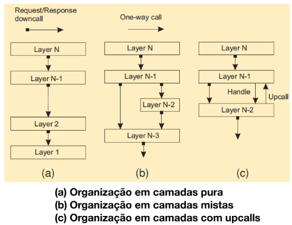
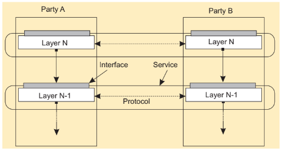
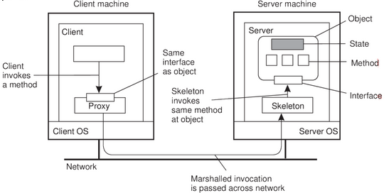

- Um objetivo importante dos sistemas distribuídos é separar os aplicativos das plataformas subjacentes por meio de uma camada de middleware.
	- Adotar essa camada (middleware) é uma decisão arquitetural importante e seu principal objetivo é fornecer transparência de distribuição para o desenvolvedor.
- Estilo de arquitetura de software é formado em termos
	- Componentes
	- Conexão entre Componentes
	- Dados trocados pelos Componentes
	- Configuração dos Componentes ao Sistema
- Arquitetura em Camadas
	- 
	- 
- Arquiteturas Baseadas em Objetos
	- Objetos = componentes
	- Conexão através de chamadas de método remotos
	- 
- Arquitetura Orientada a Serviços
	- As funcionalidades da aplicação devem ser disponibilizadas como Serviços.
	- Serviços são as unidades de computação básicas.
	- Um serviço é um mecanismo para permitir o acesso a uma ou mais capacidades
		- Acesso feito através de um interface
		- Sujeito a políticas e restrições
		- Fornecidos por um provedor, usado por um consumidor
		- Implementação do serviço é escondida do consumidor
- Arquiteturas centrada em Recursos (RESTful)
	- REpresentational State Transfer (Transferência de Estado Representacional)
		- Feito para permitir a comunicação entre duas aplicações quaisquer, independente de sua plataforma/linguagem de desenvolvimento
		- Sistemas que seguem os princípios do REST são chamados de RESTful
- Arquitetura de Microsserviços
	- Abordagem arquitetônica na qual o software consiste em pequenos serviços independentes que se comunicam usando APIs bem definidas.
	- Facilitam a escalabilidade e agilizam o desenvolvimento de aplicativos.
	- Sistema é criado como componentes independentes que executam cada processo do sistema como um serviço.
	- APIs leves
- Arquiteturas Baseadas em Eventos
	- Processos se comunicam por meio de propagação de eventos
	- Sistemas Pub/Sub
	- Processos fracamente acoplados