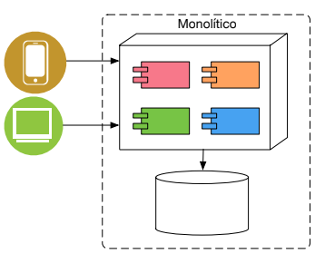
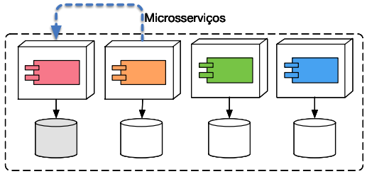
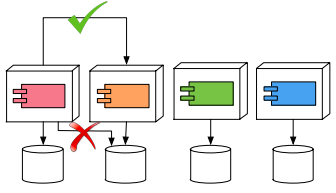
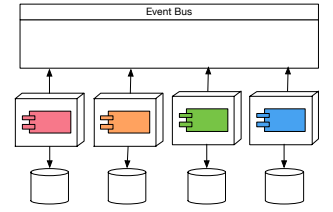

- Motivações
	- Mercado muito competitivo
	- Reuso de Software
- **Service Oriented Computing (SOC)**: um paradigma computacional que utiliza serviços como elemento de primeira classe para o desenvolvimento de aplicações distribuídas.
	- Benefícios:
		- Maior interoperabilidade
		- Maior diversidade de aplicações
		- Maior agilidade organizacional
		- Aumento do alinhamento entre negócios e tecnologia
	- Características
		- SOC separa Engenharia de Software e Programação
			- Maior foco em Engenharia de Sofware
		- Partes envolvidas
			- Desenvolvedores de aplicação
			- Provedores de serviços
			- Brokers/Repositórios
		- Desenvolvimento de aplicação independente de linguagem de programação e Sistema Operacional
		- "Competências" das empresas expostas programaticamente
		- Integração de aplicações
	- Serviço
		- Entidade autônoma e independente de plataforma que pode ser escrito, publicado e descoberto.
		- Qualquer pedaço de código/componente de um sistema pode ser transformado em serviço.
	- Qualidade do Serviço (QoS): identifica um conjunto de atributos funcionais e não funcionais que podem ser usados para avaliar o comportamento de um serviço de diferentes perspectivas.
- **Microsserviços**
	- Sistemas Monolíticos
		- aplicativo construído como uma única unidade
		- Quaisquer mudanças no sistema envolvem a construção e implantação de uma nova versão do aplicativo do lado do servidor
		- 
	- Microsserviços: Abordagem para desenvolver um único aplicativo como um conjunto de pequenos serviços, cada um executando em seu próprio processo e se comunicando com mecanismos leves, geralmente uma API de recurso HTTP.
		- Estilo de arquitetura de software que estrutura um aplicativo como uma coleção de serviços autônomos que trabalham juntos.
		- 
		- Problemáticas
			- Qual tamanho do microsserviço?
			- Como gerenciar os dados?
	- Comunicação entre Microsserviços
		- 
		- 