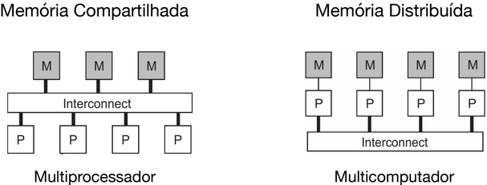
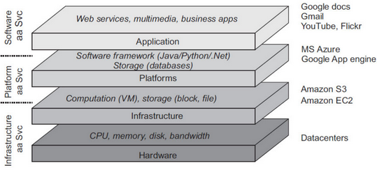
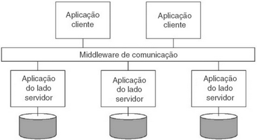
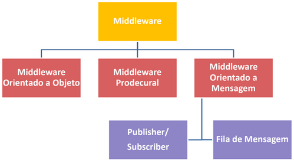
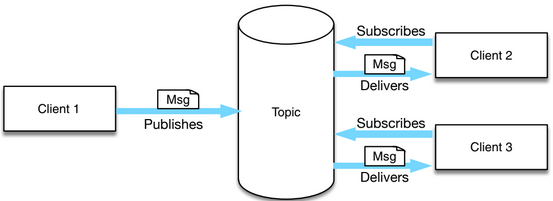
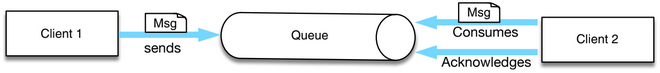

- Breve história
  collapsed:: true
	- "Os sistemas operacionais surgem para gerenciar os recursos das máquinas com mais eficiência"
	- "Os microprocessadores são desenvolvidos para aumentar o poder de processamento e diminuir o tamanho dos computadores"
	- "A rede de computadores é criada para permitir que as estações compartilhassem do mesmo meio de transmissão"
- "Um sistema distribuído (SD) é um conjunto de ==elementos de computação (nós) independentes== que se apresenta a seus usuários como um sistema único e coerente" (Tanenbaum)
	- Nós, que funcionam de forma independente, são programados para atingir objetivos comuns por meio de **troca de mensagens** entre si.
- Algumas consequências da distribuição dos elementos dos sistemas...
	- **Concorrência**: programas são executados de forma concorrente, como controlar o acesso a recursos compartilhados?
	- **Inexistência de relógio global**: como garantir a sequência correta das mensagens trocadas?
	- **Falhas independentes**: cada componente pode falhar de forma independente dos demais, como garantir que o sistema continue funcionando?
- A principal motivação para construção e uso de SDs é  o ==compartilhamento de recursos==.
- Exemplos de SDs: Gmail, Netflix, Whatsapp, Zoom, Nubank, Google, ...
- ==Principais desafios==
	- **Heterogeneidade**: software e hardware variados.
	- **Tolerância a Falhas**: uma falha em um componente não pode inviabilizar o sistema todo.
	- **Sistemas Abertos**: SDs são compostos por componentes que se comunicam através de vários padrões/protocolos, é necessário uma forma de fazer eles se comunicarem.
	- **Concorrência**: múltiplos componentes podem necessitar do mesmo recurso compartilhado.
	- **Segurança**: como garantir a segurança do sistema e dados compartilhados entre os componentes?
	- **Qualidade de Serviço**:
	- **Escalabilidade** (ou elasticidade): possibilidade de aumentar/diminuir recursos dependendo da demanda.
	- **Transparência**
		- **Acesso**: a programação para acessar um serviço é similar, independente se ele estiver executando localmente ou remotamente.
		- **Concorrência**: usuários compartilham componentes/recursos sem saber.
		- **Falhas**: mascaramento de falhas de hardware/software.
		- **Localização**: acessar componentes sem saber sua localização física.
		- **Tecnologia**: tecnologias (rede, SO, hardware) são transparentes ao usuário.
- Tipos de SDs
	- **Sistemas de Computação Distribuídos de Alto Desempenho**: tarefas que necessitam de alto desempenho.
		- Iniciados com a computação paralela. 
		- **Cluster**: termo utilizado para definir dois ou mais computadores, conectados através de rede local, que trabalham em conjunto para resolver uma única tarefa. Em geral, utiliza-se computação paralela (i.e., programa constituído por partes internas que podem ser executas em paralelo por várias máquinas).
			- **Cluster Beowulf**: voltados para desempenho; utilizam uma infraestrutura de hardware comum (e.g., Desktops); rede privada e software open source (e.g., Linux); possui um nó responsável pelo controle (distribuição de tarefas e processamento) de todo o cluster.
		- **Computação em Grade (Grid)**: uso de recursos computacionais amplamente distribuídos para atingir um objetivo comum. Composto por recursos heterogêneos conectados por redes distintas, normalmente geograficamente distribuídas. Recursos de diferentes organizações são reunidos para permitir a colaboração de um grupo de pessoas/instituições
		- **Computação em Nuvem (Cloud)**: paradigma de computação em larga escala que possui foco em proporcionar economia de escala, em que um conjunto abstrato, **virtualizado**, **dinamicamente escalável** de poder de processamento, armazenamento, plataformas e serviços são disponibilizados sob demanda para clientes externos **através da Internet**. Incorpora o paradigma de Arquitetura Orientada a Serviço (Service Oriented Architecture – SOA);
			- Motivações
				- Organizações de TI gastam muito tempo (80%) com manutenção de sistemas
				- Desperdício de hardware e software
				- Permite ao usuário/empresa utilizar tecnologia sem se preocupar com os dados
				- Acesso em qualquer lugar
			- Características
				- Recursos computacionais como *commodities*
				- Pay as you go
				- Ilusão de recursos ilimitados
				- Escalabilidade e elasticidade
				- ==Virtualização==: múltiplos servidores virtuais por máquina física; hardware alocado dinamicamente de um pool de recursos; compartilhamento da infraestrutura e redução de custos.
			- Classificação
				- 
				- Infrastructure as a Service (IaaS): disponibilização de recursos de hardware (espaço em disco, capacidade de processamento).
				- Platform as a Service (PaaS): serviço para facilitar o desenvolvimento e distribuição de aplicações.
				- Software as a Service (SaaS): provê aplicações inteiras, que ao invés de serem utilizadas por um mecanismo de aquisição de licenças, são acessas diretamente pela Internet.
			- Vantagens
				- Eficiência no consumo de energia
				- Acesso aos recursos sem grande investimento em hardware e manutenção
				- Não necessidade compra de software/hardware
				- Elasticidade nos recursos (utilizar mais ou menos, sob demanda)
			- Problemáticas
				- Garantia do consumo indicado ser o verdadeiramente consumido
				- Padrões abertos: se eu precisar mudar de provedor?
				- Localização dos dados e questões legais
				- Segurança dos dados: como sei se meus dados estão seguros?
				- Acesso: como acessar com Internet lenta?
	- **Sistemas de Informação Distribuídos**: aplicações em rede precisam se integrar.
		- "São sistemas empresariais desenvolvidos para integrar diversas aplicações individuais."
			- Em geral, existem barreiras para interoperabilidade
		- **Sistemas de Processamento de Transações**
			- Disponibilização de primitivas (pelo SD) para transações.
			- Transações devem ser ACID:
				- **Atômicas**: tudo ou nada
				- **Consistentes**: transação leva de um estado consistente para outro
				- **Isoladas**: transações concorrentes não interferem umas nas outras
				- **Duráveis**: mudanças realizadas pela transação são permanentes
		- **Integração de Aplicações Empresariais**
			- Utilizam um *Middleware* de comunicação.
				- "Um conjunto de serviços que ajuda a resolver problemas de heterogeneidade e distribuição" (Bernstein, 1996)
				- "Software projetado para ajudar a gerenciar a complexidade e a heterogeneidade inerente dos sistemas distribuídos" (Bakken, 2001)
				- "Software localizado entre a aplicação e o SO responsável por resolver a lacuna entre as aplicações e a infraestrutura de software/hardware" (Schmidt, 2003)
				- 
			- Em suma, middlewares disponibilizam uma interface alto nível para integração das aplicações individuais.
			- 
				- **Procedural**: permite enviar uma requisição a um outro componente da aplicação, tanto a requisição quanto reposta são empacotadas em mensagens. RPC é um exemplo. É necessário que o outro componente esteja ativo e é necessário conhecer o outro componente.
				- **Orientado a Objetos**: contraparte do procedural para POO. RMI é um exemplo. É necessário que o outro componente esteja ativo e é necessário conhecer o outro componente.
				- **Orientado a Mensagem**: aplicações enviam mensagens a pontos lógicos de contato, o middleware é responsável pela entrega da mensagem ao(s) interessado(s).
			- Tipos de comunicação
				- **Síncrono**: transmissor passivo até receber mensagem do receptor.
				- **Assíncrono**: transmissor sempre ativo.
				- **Orientado a Solicitação**
				- **Orientado a Mensagem**
			- Modelos de Troca de Mensagem
				- **Publish-Subscribe**
					- {:height 209, :width 553}
				- **Point-to-Point**
					- 
	- **Sistemas Pervasivos**: caracterizados pela mobilidade. Dispositivos móveis e embutidos.
-