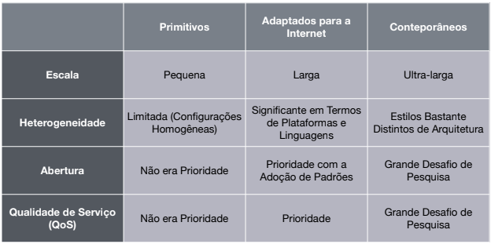

- As propriedades e os problemas de projeto de sistemas distribuídos podem ser
  capturados, descritos e discutidos por meio do uso de modelos
	- **Modelos Físicos**: computadores e outros equipamentos que constituem o sistema. São considerados, por exemplo, redes de interconexão mas sem determinar a tecnologia específica.
		- Elementos de hardware e conexões.
		- Abstração dos detalhes específicos do computador e das tecnologias de rede.
		- Gerações de SD
			- **Primitivos**: 10-100 nós interconectados por rede local.
			- **Adaptados para Internet**: conjunto extensível de nós conectados a Internet. Ênfase em QoS. Prover serviços fora dos limites organizacionais.
			- **Contemporâneos**: computação móvel e ubíqua. Computação em Nuvem.
			- 
	- **Modelos Arquiteturais**: descrevem o sistema em termos de tarefas de computação e comunicação a serem realizadas (e.g., Cliente-Servidor, P2P).
		- Quais entidades que estão se comunicando?
		- Como elas se comunicam?
		- Quais papéis e responsabilidade as entidades tem na arquitetura geral?
		- Onde elas estão localizadas na infraestrutura distribuída física?
	- **Modelos Fundamentais**: perspectiva abstrata para descrever soluções para problemas individuais enfrentados pela maioria dos sistemas distribuídos.
		- Modelos anteriores se preocupavam com: Desempenho, Confiabilidade e Segurança.
		- Modelo fundamento se debruçam sobre: Interação, Falha e Segurança.
			- Para cada um dos pontos, existe um modelo.
	-