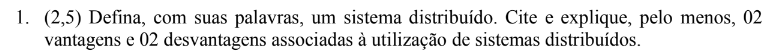
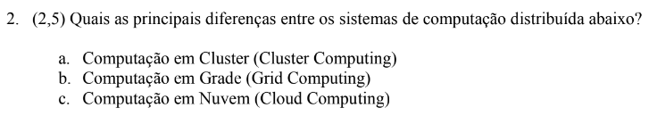
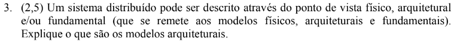
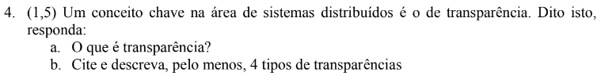

- 1ªVA Antiga
	- 
		- Um SD é um sistema formado por múltiplos componentes (nós) computacionais independentes que coordenam suas atividades através da troca de mensagens. Tais sistemas se apresentam ao usuário como se fossem um único sistema coerente.
		- Uma das principais vantagens é a **elasticidade**. É possível disponibilizar mais ou menos recursos para componentes específicos do sistema, sem a necessidade de aumentar o sistema como um todo. Dessa forma, é possível ter uma elasticidade nos recursos utilizados de acordo com a demanda dos usuários. Por exemplo, se um módulo do SD está sendo mais utilizado, é possível aumentar os recursos computacionais para esse componente.
		- Outra vantagem é o compartilhamento de recursos. Com SDs, é possível compartilhar recursos computacionais de forma simples e direta, sendo essa característica vantajosa para muitos cenários.
		-
	- 
	- 
	- 
- Questões relacionadas
	- O que é um middleware e dê um exemplo de um.
	- Qual a diferença entre computação em cluster e em grade?
	- Diferença de RPC e RMI
	- Qual a importância de threads para sistemas distribuídos?